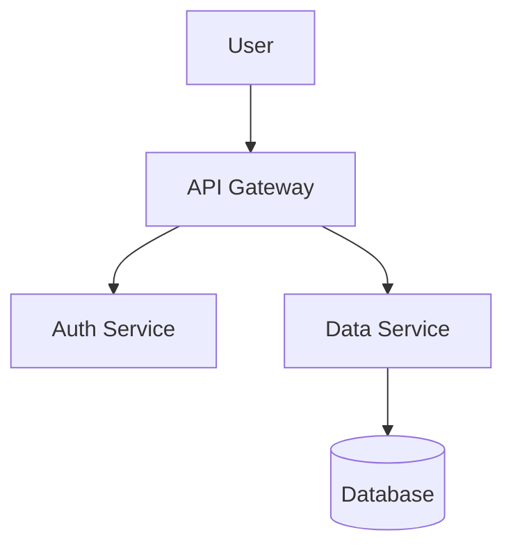

# mdPDF

Write Markdown, get a styled PDF. Live preview, custom typography, and Mermaid diagram support — no LaTeX, no install.

**Live:** https://mdpdf.whhite.com

---

## Features

- **Live preview** — see your formatted document as you type
- **Mermaid diagrams** — flowcharts, sequence diagrams, ER diagrams render in both preview and PDF export
- **Style sidebar** — fonts, colors, line height, margins, header/footer text
- **Format toolbar** — select text and apply Bold, Italic, Underline, Strikethrough, Text Color, Highlight, Font Family, Font Size
- **PDF export** — Puppeteer renders the same output you see in the preview
- **File upload** — drag in any `.md` file

## Mermaid example

````markdown

````

The diagram renders live in the preview and exports correctly to PDF.

## Self-hosting

Requires Docker (Chromium included in the image).

```bash
git clone https://github.com/ibrahimokdadov/mdPDF
cd mdPDF
docker build -t mdpdf .
docker run -p 3000:3000 mdpdf
```

Open http://localhost:3000.

## Development

```bash
npm install
npm run dev
```

Open http://localhost:3000.

```bash
npm test        # run tests
npm run build   # production build
```

## Stack

Next.js 14, TypeScript, Tailwind CSS, Puppeteer, rehype, Mermaid
